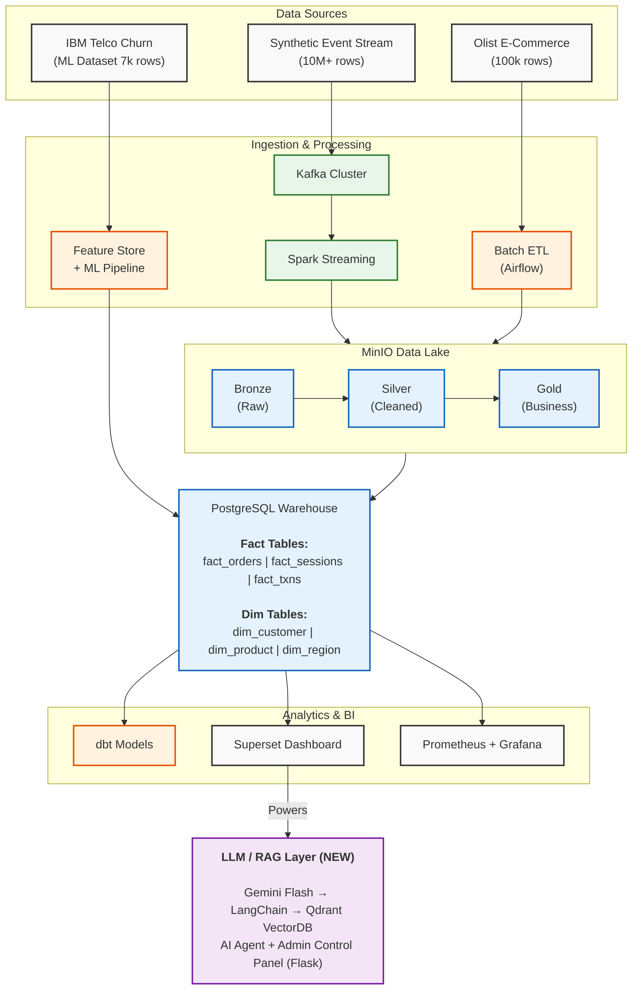

# Customer360 Data Platform

> A production-grade, real-time customer intelligence platform processing **10M+ streaming events** using Kafka, Spark Streaming, Airflow, PostgreSQL, dbt, Docker — with an integrated **LLM-powered AI Agent** for natural language data querying.

---

## Architecture



---

## Tech Stack

| Layer | Technology |
|-------|-----------|
| Event Streaming | Apache Kafka 7.5 |
| Stream Processing | Apache Spark 3.5 (Structured Streaming) |
| Orchestration | Apache Airflow 2.8 |
| Data Lake | MinIO (S3-compatible) |
| Data Warehouse | PostgreSQL 15 |
| Transformations | dbt-core |
| Analytics | Apache Superset / Power BI |
| Data Quality | **Great Expectations** + Custom Spark DQ Engine |
| Data Lineage | **DataHub** (OpenMetadata-compatible) |
| CI/CD | **GitHub Actions** (pytest, ruff, dbt, docker) |
| ML | XGBoost, scikit-learn, MLflow |
| LLM / RAG | Google Gemini Flash, LangChain, Qdrant |
| AI Agent | LangGraph ReAct Agent |
| Admin Panel | Flask (Admin Control Panel) |
| Monitoring | Prometheus + Grafana |
| Containerization | Docker + Docker Compose |
| Language | Python 3.11 |

---

## Project Structure

```
Customer360-Data-Platform/
├── producer/               # Kafka event producers
│   ├── event_generator.py  # 10M+ synthetic event generation
│   ├── kafka_producer.py   # Kafka publisher
│   └── schemas.py          # Pydantic event schemas
├── consumer/               # Kafka consumers
│   └── kafka_consumer.py   # Bronze layer writer
├── spark_jobs/             # Spark Streaming jobs
│   ├── streaming_processor.py
│   ├── aggregations.py
│   └── data_quality.py
├── airflow/
│   └── dags/               # 7 orchestration DAGs (incl. LLM ingestion)
├── dbt/                    # Transformation models
│   ├── models/
│   │   ├── staging/        # Raw → Staging (3 models)
│   │   ├── intermediate/   # Business logic
│   │   └── marts/          # Analytics-ready (4 models)
├── warehouse/
│   └── migrations/         # PostgreSQL DDL scripts
├── data_quality/           # Great Expectations suite (NEW)
│   ├── ge_suite.py         # GE checkpoint runner
│   └── expectations/       # 12-rule expectation suite JSON
├── lineage/                # DataHub lineage publisher (NEW)
│   └── publish_lineage.py  # Emits pipeline lineage
├── tests/                  # Pytest unit tests (NEW)
│   ├── test_data_quality.py
│   ├── test_event_schemas.py
│   └── test_ge_suite.py
├── ml/
│   ├── features/           # Feature engineering
│   └── models/             # Churn prediction
├── llm/                    # LLM / RAG pipeline (NEW)
│   └── ingest_to_vectordb.py  # Ingests warehouse data → Qdrant
├── admin_panel/            # AI-powered Admin Control Panel (NEW)
│   ├── app.py              # Flask application
│   └── agent/              # LangGraph ReAct agent + tools
├── monitoring/
│   ├── prometheus/
│   └── grafana/
├── docker-compose.yml
├── .env.example            # Environment variable template
├── requirements.txt
└── README.md
```

---

## Quick Start

### Prerequisites

- Docker Desktop (16GB RAM recommended)
- Python 3.11+
- Git
- Google AI Studio API Key (free at [aistudio.google.com](https://aistudio.google.com/apikey))

### 1. Clone & Configure

```bash
git clone https://github.com/ark5234/Customer360-Data-Platform.git
cd Customer360-Data-Platform
cp .env.example .env
# Edit .env and add your GOOGLE_API_KEY
```

### 2. Start Infrastructure

```bash
docker compose up -d
```

Services start on:

| Service | URL | Credentials |
|---------|-----|-------------|
| Kafka UI | http://localhost:8080 | — |
| Airflow | http://localhost:8081 | admin / admin |
| Spark UI | http://localhost:8082 | — |
| MinIO | http://localhost:9001 | customer360 / customer360secret |
| Grafana | http://localhost:3000 | admin / admin |
| Superset | http://localhost:8088 | admin / admin |
| Prometheus | http://localhost:9090 | — |
| Qdrant UI | http://localhost:6333/dashboard | — |
| DataHub (Lineage)| http://localhost:9002 | datahub / datahub |
| **Admin AI Panel** | **http://localhost:5000** | **—** |

### 3. Generate Synthetic Data

```bash
pip install -r requirements.txt
python producer/event_generator.py --events 10000000 --output data/synthetic/
```

### 4. Start Kafka Producer

```bash
python producer/kafka_producer.py
```

### 5. Submit Spark Streaming Job

```bash
docker exec spark-master spark-submit \
  --master spark://localhost:7077 \
  --packages org.apache.spark:spark-sql-kafka-0-10_2.12:3.5.0 \
  /opt/spark-apps/streaming_processor.py
```

### 6. Enable Airflow DAGs

Navigate to http://localhost:8081 and enable:
- `dag_kafka_to_bronze`
- `dag_bronze_to_silver`
- `dag_silver_to_gold`
- `dag_gold_to_warehouse`
- `dag_feature_engineering`
- `dag_model_retraining`
- `llm_vectordb_ingestion` *(re-ingests support tickets into Qdrant VectorDB daily)*

### 7. Run dbt Transformations

```bash
cd dbt
dbt deps
dbt run
dbt test
```

### 8. Ingest Data into Qdrant (RAG)

```bash
python llm/ingest_to_vectordb.py
```

### 9. Launch AI Admin Panel

```bash
python admin_panel/app.py
# Visit http://localhost:5000
```

---

## Data Architecture

### Medallion Architecture (Data Lake)

```
Bronze  →  Raw Kafka events (JSON, partitioned by topic/date/hour)
Silver  →  Cleaned, GE-validated Parquet (12-rule Great Expectations suite)
Gold    →  Business aggregates, customer 360 views, KPIs
```

### Warehouse Star Schema

```
fact_orders ──── dim_customer
     │       ──── dim_product
     │       ──── dim_region
     │       ──── dim_time
fact_sessions
fact_transactions
```

### LLM / RAG Pipeline

```
Support Tickets (data/tickets.json)
    ↓  (llm/ingest_to_vectordb.py / Airflow llm_vectordb_ingestion DAG)
Qdrant VectorDB (support_tickets collection)
    ↓
HuggingFace all-MiniLM-L6-v2 (local embeddings, free)
    ↓
LangChain Retriever
    ↓
Google Gemini 3.5-Flash LLM (→ 2.5-Flash fallback on rate limit)
    ↓
LangGraph ReAct Agent (tools: query_warehouse SQL, search_customer_tickets RAG)
    ↓
Admin Panel Chat UI (http://localhost:5000)
```

---

## Datasets Used

| Dataset | Source | Size | Purpose |
|---------|--------|------|---------|
| Synthetic Events | Python + Faker | 10M+ rows | Kafka streaming, Spark processing |
| Olist E-Commerce | Kaggle | ~100k orders | Warehouse modeling, analytics |
| IBM Telco Churn | Kaggle | 7,043 rows | ML pipeline, churn prediction |

---

## Resume Bullets

```
• Architected a real-time customer intelligence platform processing 10M+ streaming events
  using Kafka, Spark Streaming, Airflow, PostgreSQL, and Docker

• Built distributed ETL pipelines with automated orchestration, schema validation, and
  medallion architecture (Bronze/Silver/Gold) data lake design

• Implemented dual-layer data quality: Great Expectations for batch validation (12 rules)
  + custom Spark DQ engine for streaming — achieving 99.8%+ pass rate

• Integrated DataHub to emit end-to-end data lineage across 10 pipeline stages, providing
  full traceability from synthetic event generation to dbt marts

• Automated testing and deployment with GitHub Actions CI/CD pipelines (pytest, ruff, dbt, docker)

• Designed dimensional warehouse models (100k+ records) and dbt transformation workflows
  powering customer retention, revenue, and product analytics dashboards

• Implemented a RAG-based AI agent using Google Gemini Flash, LangChain, LangGraph,
  and Qdrant VectorDB enabling natural-language querying of 10M+ customer events

• Implemented observability using Prometheus and Grafana (50+ metrics) while generating ML-ready
  feature stores for downstream XGBoost churn prediction models (AUC-ROC 0.87)
```

---

## Environment Variables

Copy `.env.example` to `.env` and fill in your values:

```bash
cp .env.example .env
```

> ⚠️ **Never commit `.env` to git.** It is listed in `.gitignore`. Only `.env.example` (with placeholder values) should be tracked.

Key variables to set:

| Variable | Description |
|----------|-------------|
| `GOOGLE_API_KEY` | Google AI Studio API key for Gemini LLM |
| `POSTGRES_PASSWORD` | PostgreSQL password (default: `customer360secret`) |
| `MINIO_SECRET_KEY` | MinIO secret key (default: `customer360secret`) |
| `QDRANT_URL` | Qdrant endpoint (default: `http://localhost:6333`) |

---

## License

MIT

---

**GitHub**: https://github.com/ark5234/Customer360-Data-Platform

**Built with 💙 by [ark5234](https://github.com/ark5234)**
